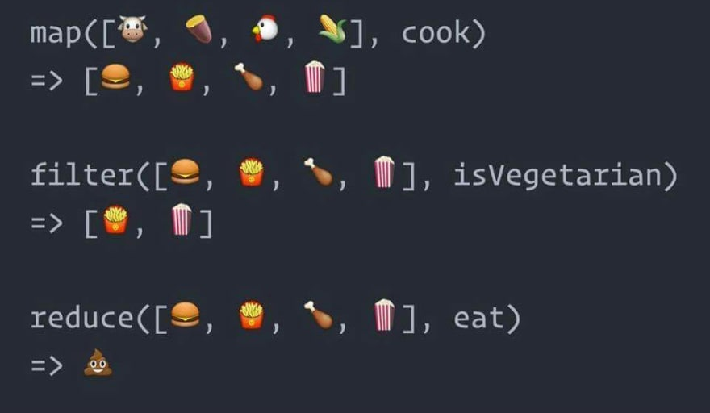

# Buổi 1
- Tổng quan khoá học
- Ôn lại JS và tìm hiểu ES6

## Tổng quan khoá học 
### Backend
- 9, 10 buổi
- Hiểu được NodeJS, kiến trúc và khả năng làm việc
- Dùng Express để thiết kế RestAPI
- Sử dụng cơ sở dữ liệu MongoDB
- Thực hành một số nghiệp vụ ở Backend như CRUD, Xác thực, Upload, Error handling
- [Roadmap](https://github.com/aliyr/Nodejs-Developer-Roadmap/blob/master/ReadMe.md)

#### Front-end React-JS
- 9, 10 buổi
- Hiểu các khái niệm React và vận dụng để làm giao diện
- Tích hợp với Backend
- Sử dụng các thư viện của hệ sinh thái React như react router, redux
- Sử dụng thư viện UI (antd/ material design)
- [Roadmap](https://github.com/adam-golab/react-developer-roadmap)

## Review về Javascript
JS là một trong những ngôn ngữ lập trình phổ biến nhất trên thế giới [Nguồn](https://insights.stackoverflow.com/survey/2021#most-popular-technologies-language)

JS ban đầu chỉ dùng để tương tác đơn giản trên trình duyệt, giúp các trang web thêm sinh động. Theo thời gian, JS gần như có thể làm được mọi thứ:
- Frontend: JS, jQuery, React, Vue, Angular
- Backend: NodeJS, ExpressJS
- Mobile: React Native
- Desktop: Electron

https://www.freecodecamp.org/learn/javascript-algorithms-and-data-structures/#basic-javascript

https://www.w3schools.com/js/

### JS data type
Trong JS có 6 kiểu dữ liệu cơ bản: number, boolean, string, null, undefined, Object
Lưu ý : Array và Function được coi là subtype của Object (nhóm con), chứ nó không được coi như type của JavaScript.

number, boolean, string, null, undefined là primitive types (kiểu nguyên thủy)

Object, Array, Function là reference type (kiểu tham chiếu)

Hiểu một cách đơn giản thì giá trị của biến kiểu nguyên thuỷ chính là giá trị thật, còn kiểu tham chiếu thì giá trị biến là địa chỉ ô nhớ

```js
// Copying a primitive
var a = 13         // gán `13` vào `a`
var b = a          // copy giá trị `a` vào `b`
b = 37             // gán `37` vào `b`
console.log(a)     // => 13
```
```js
// Copying a reference
var a = { c: 13 }  // gán địa chỉ tham chiếu of đối tượng vào `a`
var b = a          // copy địa chỉ của a vào giá trị của b
b.c = 37           // chỉnh sửa giá trị của đối tượng mà `b` tham chiếu tới
console.log(a)     // => { c: 37 }
```
```js
// So sánh
var a = { c: 1 }
var b = { c: 1 }
var c = 4
var d = 4
console.log(a === b) // false
console.log(c === d) // true
```
`Tìm hiểu thêm khái niệm: pass by value, pass by reference`

Kiểu dữ liệu của biến được định nghĩa qua giá trị chứ không phải qua biến
```
var a = 3;
console.log(typeof a) // number
a = 'hello';
console.log(typeof a) // string
```
### Coercion
Đây là cách thức chuyển đổi type của các giá trị trong javascript, một cách ngầm định
```
// So sánh
console.log(69 == '69')

// Falsy and Truthy
falsy  -> false, '', "", 0, -0, 0n, NaN, null, undefined
truthy -> anything that is not mentioned above
```
Khi so sánh nên dùng === để compare value và type

### Object
Object là một tập hợp các trường dữ liệu (property) và các hàm (method)
```
var person = {
    firstName: 'Linh',
    lastName: 'Hoang Thuy',
    18: 'Age', // Property có tên là số, không dùng dotNotation được
    showName: function() {
        console.log(this.firstName + ' ' + this.lastName);
    }
};

console.log(person.firstName); // Linh
console.log(person['firstName']); // Linh

console.log(person.18); // Bị lỗi
console.log(person['18']); // Age

console.log(person.showName()); // Hoang Thuy Linh
console.log(person['showName']()); // Hoang Thuy Linh

for(var prop in person) {
  console.log(prop); // firstName, lastName, showName
}
```
### Array
Array là tập hợp các phần tử. JS cung cấp rất nhiều phương thức để xử lý



Lưu ý: Các hàm filter, map, reduce trả về kết quả mảng mới mà không chỉnh sửa mảng ban đầu

Còn các hàm như sort, push, splice thì chỉnh sửa trực tiếp vào mảng

### Callback
Callback là kỹ thuật truyền 1 function vào 1 function khác làm tham số

Thứ tự thực hiện là : hàm chính bắt đầu -> hàm chính kết thúc -> hàm callback sẽ được gọi

```
function first(){
  // Mô phỏng delay code
  setTimeout( function(){
    console.log("Một");
  }, 5000);
}
function second(){
  console.log("Hai");
}

first();
second();

```
### DOM
DOM (Document Object Model) là mô hình các đối tượng HTML. JS có thể truy xuất và xử lý DOM. Từ đó, giao diện người dùng sẽ được tuỳ biến theo nghiệp vụ


### var, const, let
Khác biệt nhau ở scope
- var là function scoped
```
  var greeting = "hey hi";
  var times = 4;

  if (times > 3) {
    var greeting = "say Hello instead"; 
  }

  console.log(greeting); //"say Hello instead"
```
- let, const là block scoped
```
  let greeting = "hey hi";
  let times = 4;

  if (times > 3) {
    let greeting = "say Hello instead";
    console.log(greeting); // "say Hello instead"
  }

  console.log(greeting); // "hey Hi"
```
const với let khác nhau ở chỗ biến khai báo const thì không được gán lại giá trị

`Lưu ý: Tốt nhất là dùng const, let trong mọi trường hợp dùng biến JS để tránh phát sinh các bug không đáng có như trùng scope, hoisting hoặc biến tự động lên global`

Tìm hiểu thêm về hoisting

#### Câu hỏi
Dự đoán kết quả in ra của 2 code sau
```
  var arrays = [];
  for (var i = 0; i < 2; i+=1) {
    arrays[i] = function() {
      console.log(i)
    }
  }
  arrays[0]();
  arrays[1]();
```
```
  var arrays = [];
  for (let i = 0; i < 2; i+=1) {
    arrays[i] = function() {
      console.log(i)
    }
  }
  arrays[0]();
  arrays[1]();
```

### Closure
Closure là một function có thể truy cập các biến nằm ngoài function đó. Thông thường, closure chính là kết quả trả về của một function

Closure là một khái niệm khó tuy nhiên nó ẩn trong hầu hết các pattern của thư viện hoặc framework mà lập trình viên không để ý
```
function makeCounter() {
  let count = 0;

  return function() {
    return count++;
  };
}

let counter = makeCounter();
counter()
counter()
```
### Template String
Để format string theo biến, tiện hơn rất nhiều sao với cộng chuỗi thông thường
```
var name = "Bob", time = "today";
// Cách cũ
console.log("Hello " + name + " how are you " + time + " ?");

// Dùng string interpolation, để ý dấu `
console.log(`Hello ${name}, how are you ${time}?`);
```

### Arrow function
Thay vì khai báo function thông thường, sử dụng => để gắn gọn hơn
```
var numbers = [1, 2, 3, 4, 5, 6, 7, 8, 9, 10];

// Giả sử ta muốn tìm các số chẵn
// Cách viết cũ
let odd = numbers.filter(function(n) { return n % 2 == 1 });
console.log(odd);

// Với arrow
odd = numbers.filter(n => n % 2 == 1);
console.log(odd);
```
Sự khác nhau giữa function thông thường với arrow function là giá trị this được gán. [Đọc thêm](https://viblo.asia/p/su-khac-biet-giua-arrow-function-va-function-trong-javascript-07LKXpw2KV4)

### Default parameter, Destructuring, Spread Operator, Rest Operator
Default parameter để xác định giá trị mặc định tham số truyền vào
```
// Cách cũ
let sayHi = (message) => {
  message = typeof message !== 'undefined ? 'Hello JS';
  console.log(message);
}
// Cách mới
let sayHi = (message = 'Hello JS') => {
console.log(message);
```

Destructuring giúp việc lấy giá trị trong array và object gọn gàng hơn
```
// Array destructuring
const foo = ['one', 'two', 'three'];

const [red, yellow, green] = foo;
console.log(red); // "one"
console.log(yellow); // "two"
console.log(green); // "three"
```
Spread Operator ... vs ...rest operator
```
const iphones = ['iphone11', 'iphone12', 'iphone13'];
const macbooks = ['macbook2015', 'macbook2016', 'macbook2017'];

// concat array
const appleProducts = [...iphones, 'iphoneX', 'iphoneXS', ...macbooks, 'macbookM1'];
// copy array
const newModels = [...iphones];
// arguments in function
function sum(x, y, z) {
  return x + y + z;
}

const numbers = [1, 2, 3];

console.log(sum(...numbers));
// expected output: 6

// rest
// parameter of function
function calculateGPA(math, literature, ...rest) {
  console.log(rest);
}
// spread tach array, rest gom lai thanh array
calculateGPA(8, 6, 5, 4, 3);

// Destructuring
const courses = ['C4E', 'CI', 'Web', 'Mobile'];
const [beginner, medium, ...advances] = courses
console.log(beginner, medium, advances) // C4E, CI, ['Web', 'Mobile']

// Áp dụng tương tự với object
let obj1 = { foo: 'bar', x: 42 };
let obj2 = { foo: 'baz', y: 13 };

let clonedObj = { ...obj1 };
// Object { foo: 'bar', x: 42 }

let mergedObj = { ...obj1, ...obj2 };
// Object { foo: 'baz', x: 42, y: 13 }

const { foo, ...position } = mergedObj
// foo = bar, position = { x: 43, y: 13 }
```

### Object
Property shorthand
```
let cat = 'Miaow';
let dog = 'Woof';
let bird = 'Peet peet';

// Cách cũ
let someObject = {
  cat: cat,
  dog: dog,
  bird: bird
}
console.log(someObject);

// Cách mới
someObject = {
  cat,
  dog,
  bird
}
console.log(someObject);
```
Method definition shorthand
```
const rain = {
  // bringUmbrella: function() {}
  
  bringUmbrella() {
    return '☔️'
  }
}
```
Computed property keys
```
const key = 'name';
const value = 'Atta';

const user = {
    [key]: value
};

console.log(user.name); // Atta
```
### Promise, Async, Await
### Promise
Promise là cú pháp của ES6 để giúp tránh hiện tượng callback hell

Cú pháp

```
let promise = new Promise(function(resolve, reject) {
  // Code here
});
```
Trong đó:
Hàm được truyền vào new Promise gọi là executor.

Ban đầu, Promise có state là pending và kết quả value là undefined

Khi executor kết thúc công việc, nó sẽ gọi đến 1 trong 2 hàm được truyền vào

- resolve(value): để xác định rằng công việc đã thực hiện thành công => state chuyển thành fulfilled => kết quả là value
- reject(error): để xác định rằng đã có lỗi xảy ra => state chuyển thành rejected => kết quả là error

Vậy Promise có 3 trạng thái
- Pending: promise đang thực hiện chưa xong
- Full filled: trạng thái đã thực hiện xong, kết quả thành công
- Rejected: trạng thái đã thực hiện xong, kết quả thất bại


Các method của Promise

- then(): Được gọi khi promise thành công, nhận parameter là 1 callback function, trả về dữ liệu của resolve

- catch(): được gọi khi promise thất bại, nhận parameter là 1 callback function, trả về dữ liệu của reject

- finally(): Được gọi khi cả thành công và thất bại -> Promise state : settled

### Async Await
Cú pháp giúp cho Promise giống với chương trình xử lý đồng bộ
```
function resolveAfter2Seconds() {
  return new Promise(resolve => {
    setTimeout(() => {
      resolve('resolved');
    }, 2000);
  });
}

async function asyncCall() {
  console.log('calling');
  const result = await resolveAfter2Seconds();
  console.log(result);
  // expected output: "resolved"
}

asyncCall();

```
Chú ý
- Giá trị trả về của một hàm async là một promise
- Await chỉ lên dùng với một promise


