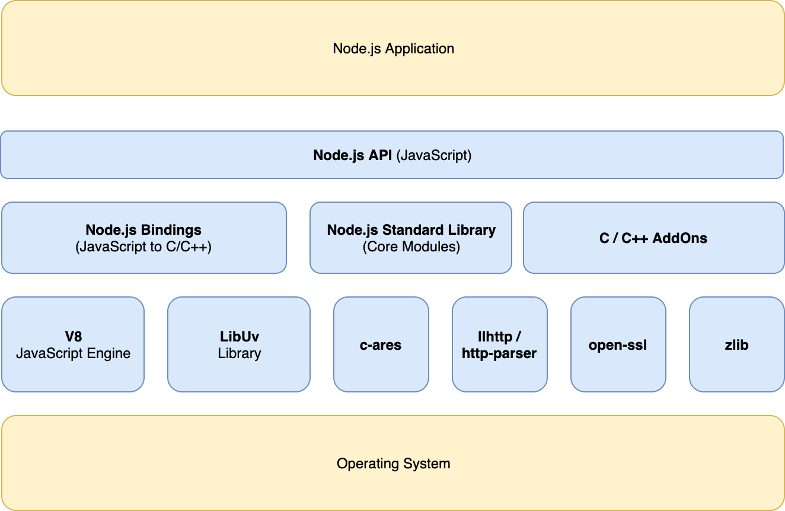

# Buổi 2
- Tổng quan về web
- Tổng quan về NodeJS
- Module trong NodeJS

## Kiến trúc của web


Frontend là phần tương tác với người dùng là phần người dùng nhìn thấy và tương tác: giao diện web, app.

Backend có chức năng hồi đáp những yêu cầu từ Front-end. Thường xử lý lưu trữ dữ liệu và logic nghiệp vụ.

## NodeJS
Runtime environment built on Chrome's V8 JavaScript engine => NodeJS là môi trường chạy JS trên máy tính chứ không phải ngôn ngữ lập trình, không phải framework

Nhờ NodeJS, JS có thể thao tác với phần cứng máy tính, thao tác với cơ sở dữ liệu => Có thể code được Backend tương tự như Java, C#, Go

### Cách cài đặt
Windows: Download bản LTS mới nhất trên [Trang chủ NodeJS](https://nodejs.org/en/), cài như cấc phần mềm bình thường

MacOS: Cài qua Homebrew
[Homebrew](https://brew.sh/)
```
brew install node
```
Linux: 
```
sudo apt install nodejs
```
Kiểm tra nodejs đã cài đặt thành công hay chưa
```
node -v
```

### Làm quen với NodeJS
Tạo file index.js và chạy thử
```
# index.js
const a = 1;
const b = 2;
console.log(a+b);
# cmd
node index.js
```
NodeJS và V8 Chrome trên browser là hai cái hoàn toàn độc lập. Một số biến global trên browser sẽ không có hoặc khác hẳn về mặt ngữ nghĩa với NodeJS. Ví dụ như document, window,...

### Kiến trúc của NodeJS

Link tham khảo [kiến trúc](https://chathuranga94.medium.com/nodejs-architecture-concurrency-model-f71da5f53d1d)
## Event loop
Event loop (vòng lặp sự kiện) là cơ chế lắng nghe các sự kiện từ stack và event queue để xử lý giúp JS có thể xử lý nhiều tác vụ cùng lúc
Để hiểu rõ hơn, có thể xem ví dụ trong link sau:
http://latentflip.com/loupe/?code=c2V0VGltZW91dChmdW5jdGlvbiB0aW1lb3V0KCkgewogICAgY29uc29sZS5sb2coIkNsaWNrIHRoZSBidXR0b24hIik7Cn0sIDApOwoKY29uc29sZS5sb2coIldlbGNvbWUgdG8gbG91cGUuIik7!!!PGJ1dHRvbj5DbGljayBtZSE8L2J1dHRvbj4%3D

Ví dụ trên là cơ chế trên browser tuy nhiên NodeJS cũng tương tự như vậy (thay thế WebAPIs thành NodeJS API)


NodeJS là Single Threaded => Do chỉ có một thread (một call stack) cho một chương trình NodeJS

Non-Blocking I/O => Chương trình sẽ không phải chờ các tác vụ I/O mà giao cho các tầng core C++ hoặc hệ thống xử lý

Asynchronous => Các tác vụ không cần thực hiện tuần tự (đợi nhau kết thúc) => cần cung cấp một phương thức để thực hiện sau khi một tác vụ kết thúc (callback)

### Module trên NodeJS
Theo lý thuyết thì có thể viết tất cả code trong 1 file, tuy nhiên như vậy sẽ rất khó quản lý và tái sử dụng

=> Cần chia nhỏ code thành các file để dễ quản lý

Có các loại module như sau
- Core Modules
- Local Modules
- Third Party Modules (Modules người khác viết đẩy lên npmjs.com)

#### Module xử lý file
fs là một module có sẵn của NodeJS để thao tác với file
```
const fs = require('fs');
const path = require('path');
// write
fs.writeFile('helloworld.txt', 'Hello World!', function (err) {
    if (err) return console.log(err);
    console.log('Hello World > helloworld.txt');
});
// read
fs.readFile(path.resolve(__dirname, 'helloworld.txt'), 'utf8', (err, data) => {
    console.log(err);
    console.log(data)
})
```
Tham khảo thêm tại https://nodejs.org/api/fs.html


#### Module http
```
// khai báo sử dụng module HTTP
const http = require('http');
//Khai báo sử dụng module fs
const fs = require('fs');
//Khởi tạo server chạy cổng 8000
http.createServer(function (req, res) {
    //định dang response head trả về
    res.writeHead('200', {'content-type': 'text/html'});
    //đọc file code.html encode utf8
    fs.readFile('code.html', 'utf8', function (err, data) {
        if (err) throw err;
        // in ra nội dung đọc được
        res.write(data);
        //kết thúc response
        res.end();
    });
}).listen(8000);
```

#### Local modules
Ngoài các core module đã được viết sẵn, để quản lý code cho tốt ta có thể dùng cơ chế module. Ở NodeJS, cơ chế được sử dụng là CommonJS. (về sau phân biệt với cách viết ES module khi lập trình React)

```
// add.js
function add(a,b) {
  return a + b;
}
// index.js
const add = require('./add.js');
console.log(add(1, 2));
```

#### Third Party Modules
npm là gì?
* node package manger 
* quản lý package của nodejs

cấu trúc thư mục
  * package.json/package-log.json
  * node_modules
  * dependencies
  * devDependencies

khởi tạo chương nodejs với npm
``` 
npm init 

npm i module_name
npm install module_name
npm uninstall module_name
```

```
const isOdd = require('is-odd');
 
console.log(isOdd('1')); //=> true
console.log(isOdd('3')); //=> true
 
console.log(isOdd(0)); //=> false
console.log(isOdd(2)); //=> false
```
