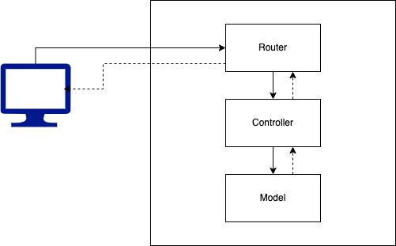

# Buổi 6
- Project structure
- Biến môi trường
- Review cách thiết kế cơ sở dữ liệu

## Project Structure
Chia các layer code để code dễ đọc, dễ bảo trì (Tưởng tượng 1 file index.js 1000 dòng xem :D). Việc bao nhiêu layer phụ thuộc vào leader và style công ty.



`Lưu ý: Layer trên sẽ gọi layer dưới hoặc các layer cùng cấp`

Mỗi layer có một trách nhiệm

- Router: Gắn route của client với server
- Controller: Xử lý nghiệp vụ
- Model: Kết nối và thao tác cơ sở dữ liệu

Đây là cách chia layer cơ bản và đơn giản nhất, một số cty có thể chia nhỏ hơn 

Ví dụ như controller chia thêm một layer thành services để tăng tính tái sử dụng code

Sau khi chia layer xong, ta có thể sử dụng 2 cách chia thư mục

Chia theo chiều ngang
```bash
├── routers
│   ├── auth.router.js
│   └── post.router.js
├── controllers
│   ├── auth.controller.js
│   └── post.controller.js
├── models
│   ├── user.js
│   └── post.js
```
Chia theo chiều dọc
```bash
├── auth
│   ├── auth.router.js
│   ├── auth.controller.js
│   └── user.js
├── post
│   ├── post.router.js
│   ├── post.controller.js
│   └── post.js
```

Trong khoá học lựa chọn cách chia theo chiều dọc, vì thấy khả năng tái sử dụng tốt hơn (khi cần feature gì, copy nguyên cục thư mục là xong) và tìm kiếm các file cũng dễ dàng hơn

## Router
Để chia được thư mục và layer như trên, Express cung cấp cơ chế gọi là Router. Hiểu một cách đơn giản, Router dùng để gom nhóm các API liên quan tới nhau (chung một prefix đường dẫn)

https://expressjs.com/en/guide/routing.html

```
// bird.js
const express = require('express')
const router = express.Router()

// define the home page route
router.get('/', (req, res) => {
  res.send('Birds home page')
})
// define the about route
router.get('/about', (req, res) => {
  res.send('About birds')
})

module.exports = router

// index.js
const birds = require('./birds')

// ...

app.use('/birds', birds)
```

## Review cách thiết kế cơ sở dữ liệu trong MongoDB

### Mối quan hệ giữa các đối tượng
Với một bài toán, ta có nhiều đối tượng cần quản lý. Các đối tượng đó có các mối quan hệ với nhau như một nhiều, nhiều nhiều, một một.

Đầu tiên, ta cần xác định các đối tượng có mối quan hệ với nhau như nào. (Ở bất cứ công nghệ gì dù SQL hay NoSQL thì điều này là bất biến)

Cách xác định, đặt 2 đối tượng ở 2 vế. Ví dụ
```
Post - Comment
Comment - Post
```
Lần lượt cho vế trái là 1, rồi xác định xem về phải là gì (1 hay nhiều)

Trong ví dụ trên thì là 
```
1 Post - nhiều comment
1 Comment - 1 Post
// Đặc điểm: 1 cái 1 - 1, 1 cái 1 - nhiều
```
Với trường hợp như này thì ta xác định được răng Post với Comment và quan hệ 1 - nhiều

Ví dụ các trường hợp khác
```
1 Post - nhiều Tag
1 Tag - nhiều Post
// Quan hệ nhiều - nhiều
// Đặc điểm: 2 cái 1 nhiều 

1 User - 1 Profile
1 Profile - 1 User
// Quan hệ một - một
// Đặc điểm: cả 2 cái 1 - 1

### Thiết kế trong MongoDB
Sau khi xác định xong cái mối liên hệ, ta mới áp vào một công nghệ cụ thể. Trong khoá này là MongoDB, trong thực tế nó còn có thể là MySQL,..

#### Quan hệ một - nhiều
Đây là mối quan hệ gặp nhiều nhất, phổ biến nhất. Ở MongoDB có 2 cách thiết kế

C1: Embedded Documents
Post có trường comments là mảng bao gồm toàn bộ bài comment của post. 

Cách này chỉ hay dùng nếu trường embeded có số lượng không quá lớn. Ví dụ như địa chỉ nhà của Users thì có thể dùng addresses

Trong trường hợp trên thì không nên vì comments có thể tăng lên rất nhiều

Ngoài ra, cách trên thì ngoài lợi ích về mặt lấy dữ liệu (Read), thì các task về CUD (create, update, delete) sẽ phức tạp hơn

C2: Document References

Sử dụng một field để liên kết với Document cần quan hệ

Bên bài Post có trường createdBy trỏ tới id của User, tương tự như thế Comment có trường postId trỏ tới id của Post 

`Trong mối quan hệ 1 - n, bên n sẽ là bên chứa ref`

#### Quan hệ nhiều nhiều
Ví dụ bài viết h sẽ được thêm tag, tag được tạo thoải mái từ user, cần nghiệp vụ hiển thị bài viết có bao nhiêu tag cũng như tìm bài viết theo tag

Khi đó ta có thể diễn giải như sau: một bài post chứa nhiều tag và mỗi tag có thể nằm trong nhiều bài post

Với c1: embed documents thì Post cần có mảng tagIds hoặc Tag cần có trường postIds

Thông thường, ta sẽ chọn đối tượng nào to hơn, chính hơn để lưu các embed documents chứ ít khi lưu cả 2 bên (phức tạp thì create, update, delete)
Ví dụ như ở trên là Post sẽ có field tagIds 

Với c2: Sẽ thêm collection để quản lý mối liên hệ nhiều, collection này gồm 2 trường ref với 2 đối tượng.

Ví dụ: TagPost gồm { tagId, postId }

Cách nào hơn? Vẫn phụ thuộc vào độ lớn của mảng embed

#### Quan hệ một - một
Đơn giản và ít gặp, thường dùng khi muốn tách một document có schema quá to. Ví dụ profile của User

Khi này ta có thể để Id Ref ở một trong hai hoặc cả hai trên schema. Ví dụ User có profileId, Profile có userId

Thông thường, chỉ lưu một bên và người ta chọn bên là con, phụ thuộc hơn để lưu ref. Ví dụ như profile thì là con của user thì user phải có trước thì profile mới có, hay nói cách khác user có thể có 0 hoặc 1 profile, còn profile thì bắt buộc phải thuộc 1 user


