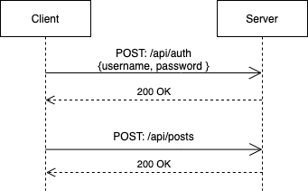
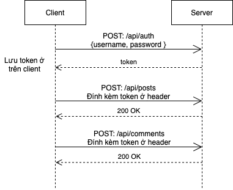
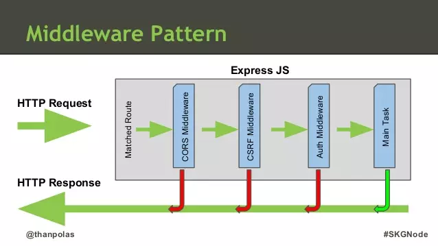

# Buổi 7
- Đăng nhập, đăng kí
- Xác thực và phân quyền

## API đăng kí, đăng nhập
Bản chất đăng kí, đăng nhập thì vẫn là quản lý đối tượng User (với ít nhất 2 trường username), tuy nhiên nếu chỉ như vậy thì gặp vấn đề là ai nắm quyền truy cập DB người đó sẽ biết được hết password của người dùng (hacker hack được là tèo :D)

=> Cần có cơ chế mã hoá password của User
=> Cơ chế hash password (băm password thành chuỗi có độ dài cố định và không thể dịch nguợc lại)

Để làm được điều này, sử dụng thư viện [bcryptjs](https://www.npmjs.com/package/bcryptjs)

```
npm install bcryptjs
// Hash password
const bcrypt = require('bcryptjs');
const salt = await bcrypt.genSalt(10);
const hash = await bcrypt.hash("dev1234", salt);

// Compare password
const matched = bcrypt.compare("dev1234", hash); // true
const matched = bcrypt.compareSync("not_bacon", hash); // false
```

## Xác thực và phân quyền
Trong một số nghiệp vụ, để thực hiện một API ta cần xác định API được gửi bởi ai đã đăng nhập hay chưa (xác thực), có quyền thực hiện hành động đó không (phần quyền)

Để làm được điều đó, ta cần *định danh* được người gửi

### Vấn đề
HTTP là stateless. Điều này có nghĩa là 2 tương tác HTTP (request - response) sẽ tách biệt không trao đổi thông tin với nhau.



Như hình trên thì API tạo bài post sẽ không biết thông tin rằng đã có API đăng nhập trước đó

Do đó API /api/post ngoài data để tạo bài post ta cần gửi thêm thông tin của user để định danh người dùng

### Giải pháp
Sau khi đăng nhập thành công, API đăng nhập trả về một token (thông tin người dùng đã được mã hoá) để định danh người dùng. Các API nghiệp vụ sau đó sẽ gửi thêm thông tin này

Luồng hoạt động được mô tả như sau


### Áp dụng vào NodeJS
Để mã hoá token, ta sử dụng một thư viện là jsonwebtoken. Do đó token còn có cái tên là jsonwebtoken (JWT)
```
npm install jsonwebtoken
```
Thông tin định danh của user để mã hoá sẽ là id của user
```
const jwt = require('jsonwebtoken');

const data = { userId: '123' }
const token = jwt.sign(
    data,
    process.env.PRIVATE_KEY,
    { expiresIn: process.env.EXPIRE_TIME }
  );
```
Hàm mã hoá là sign gồm 3 tham số
+ Tham số đầu tiên là data cần mã hoá
+ Tham số thứ hai là một khoá bí mật, khoá này được lưu trữ trên server và chỉ server biết, khoá này cũng nên set biến môi trường để không lộ trên source code
+ Tham số thứ ba là thời gian hiệu lực của jwt, sau khoảng thời gian đó jwt sẽ không còn hợp lệ

Token được gửi đến client, client sẽ lưu trữ tại browser (có thể là local storage) sau đó các lần gọi HTTP khác sẽ đính kèm token vào header. Server sẽ lấy token đó ra, giải mã và định danh người dùng

```
const token = req.headers.authorization;
try {
  if (!token) throw new Error('Empty token');

  const decodeData = jwt.verify(token, process.env.PRIVATE_KEY);
  const { userId } = decodeData;
  const existedUser = await UserModel.findById(userId);
} catch (err) {
  console.log(err);
}


if (!existedUser) throw new Error('Not existed user');
```

Hàm verify là hàm giải mã và thẩm định token đó có thật không, sử dụng khoá bí mật mà chỉ server biết. Do vậy, nếu client cố tình truyền token giả thì sẽ không thoả mãn. Ngoài ra nếu token hết hạn thì hàm này cũng văng ra lỗi.

Từ thông tin user đã định danh như trên, ta đã biết được người gửi đã đăng nhập hay chưa (xác thực)

Để làm chức năng phân quyền, đơn giản nhất ở model User ta lưu thêm role của User để xác định quyền hạn

## Middleware
Để tái sử dụng đoạn định danh như trên với mọi request, ta có thể sử dụng cơ chế của ExpressJS cũng như rất nhiều framework của ngôn ngữ khác áp dụng. Đó là [middleware](https://expressjs.com/en/guide/using-middleware.html)



Middlware đúng như tên gọi là thành phần ở giữa, xử lý logic trước khi đến logic nghiệp vụ chính

### Middleware trong Express
Trong Express, middlware bản chất là một hàm gồm 3 tham số, tham số next() giúp cho logic code được nhảy sang middlware tiếp theo
```
function (req, res, next) {
  console.log('Request Type:', req.method)
  next()
}
```

Middleware gồm 2 dạng

- Router-level middleware: Middleware gắn với từng route. Ví dụ rõ ràng nhất ở đây là middleware về xác thực, vì không phải API nào cũng cần xác thực
```
app.use("/api/posts/, async function(req, res, next) {
  const token = req.headers.authorization;

  try {
    if (!token) throw new Error('Empty token');

    const decodeData = jwt.verify(token, process.env.PRIVATE_KEY);
    // { userId: existedUser._id }
    const { userId } = decodeData;
    const existedUser = await UserModel.findById(userId);

    if (!existedUser) throw new Error('Not existed user');

    // gan them du lieu cho req
    // kĩ thuật để giao tiếp dữ liệu giữa các middleware
    req.user = existedUser;
    next();
  } catch (err) {
    res.status(401).send({ success: 0, message: err.message });
  }
}, function (req, res) {
  // Nghiệp vụ chính
})
```

- Application-level middleware: Mọi route đều sử dụng middleware này.
```
app.use(function (req, res, next) {
  console.log('Time:', Date.now())
  next()
})
```
Như ví dụ trên thì middleware có nhiệm vụ log thời gian request đến. Ngoài ra một ví dụ mà ta đã dùng từ những buổi học trước là app.use(express.json()). Bản chất đây là một middleware để parse dữ liệu người dùng gắn vào trong req.body
