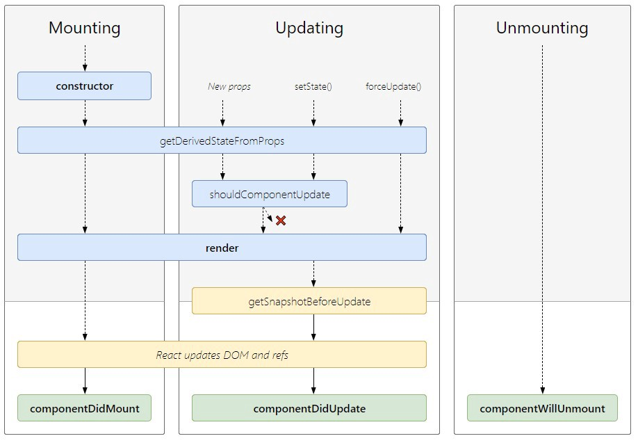

# Buổi 12
- Hiểu được Declarative vs Imperative Programming
- Làm quen Class component
- Làm quen state, props, lifecycle

# Declarative vs Imperative Programming
Imperative programming: telling the “machine” how to do something, and as a result what you want to happen will happen.

Declarative programming: telling the “machine” what you would like to happen, and let the computer figure out how to do it.

Đoạn này mình để tiếng anh vì để nhấn mạnh từ *how* và *what*. 2 đoạn code sẽ mô tả rõ 2 khái niệm

## Imperative programming

```
const container = document.getElementById(‘container’);
const btn = document.createElement(‘button’);
btn.className = ‘btn red’;
btn.onclick = function(event) {
 if (this.classList.contains(‘red’)) {
   this.classList.remove(‘red’);
   this.classList.add(‘blue’);
 } else {
   this.classList.remove(‘blue’);
   this.classList.add(‘red’);
 }
};
container.appendChild(btn);

// Imperative programming: để đổi màu của button, ta phải chỉ dẫn (how) từng bước cho máy tính hiểu
```
# Declarative programming
```
class Button extends React.Component{
  this.state = { color: 'red' }
  handleChange = () => {
    const color = this.state.color === 'red' ? 'blue' : 'red';
    this.setState({ color });
  }
  render() {
    return (<div>
      <button 
         className=`btn ${this.state.color}`
         onClick={this.handleChange}>
      </button>
    </div>);
  }
}
// Declarative programming: để đổi màu của button, ta chỉ cần đổi state (what) tượng trưng cho màu, máy tính tự tính toán để ra kết quả 
```

Declarative programming giúp việc lập trình, đặc biệt là lập trình frontend trở lên dễ dàng hơn rất nhiều. (làm việc với biến thích hơn làm việc với DOM :D). Đây là tư tưởng của các framework JS hiện đại

# State vs Props
Để mô tả được what của component thì React cung cấp hai cơ chế là props và state. Props và state bản chất sẽ là biến trong JS.

Khi đó một component sẽ re-render như sau:
- Khi props thay đổi
- Khi state thay đổi
- Khi component cha re-render (sẽ có cơ chế mà component cha re-render, component con sẽ không render)

## Props
Props của một component là dữ liệu từ component cha truyền xuống và tự component đó không thay đổi được (read-only)

Vậy làm sao để thay đổi được props => Component cha thay đổi rồi truyền xuống cho component con.

```
function Welcome(props) {
  return <h1>Hello, {props.name}</h1>;
}

const element = <Welcome name="Sara" />;
ReactDOM.render(
  element,
  document.getElementById('root')
);
```
Props có cú pháp như một attribute trong DOM.

Vì props là một biến JS nên nó có kiểu dữ liệu của JS. Ta có thể truyền string, boolean, number, object, function, array, ...

## State
State của một component là dữ liệu của chính component đó có và tự component đó có quyền thay đổi dữ liệu này

```
class Clock extends React.Component {
  constructor(props) {
    super(props);
    this.state = {date: new Date()};
  }

  componentDidMount() {
    this.timerID = setInterval(
      () => this.tick(),
      1000
    );
  }

  componentWillUnmount() {
    clearInterval(this.timerID);
  }

  tick() {
    this.setState({
      date: new Date()
    });
  }

  render() {
    return (
      <div>
        <h1>Hello, world!</h1>
        <h2>It is {this.state.date.toLocaleTimeString()}.</h2>
      </div>
    );
  }
}

ReactDOM.render(
  <Clock />,
  document.getElementById('root')
);
```

`Chú ý: Không thể thay đổi trực tiếp state như this.state = '...' mà cần qua hàm setState. Như vậy, component mới re-render`

# Lifecycle
React Component bao gồm 3 phase: 
- Mounting: React Component khởi tạo, chuyển từ DOM ảo thành DOM thật
- Updating: Sau khi gắn vào DOM thật, UI cần update giao diện thì component React sẽ re-render (với các điều kiện ở trên) và update vào DOM thật
- Unmounting: Component đó không còn tồn tại, xoá ra khỏi cây DOM thật

Với 3 phase như vậy, React Class Component có những hàm sau để xử lý

`Chú ý: Dù không khai báo trong class component thì những hàm trên vẫn chạy đủ tương ứng mỗi phase của React Component`



Tuy nhiên, trong hầu hết trường hợp ta không cần dùng full lifecycle như vậy, mà chỉ cần tập trung vào các function sau


## Constructor
- Chỉ chạy một lần khi component bắt đầu khởi tạo vừa chưa render
- Thường dùng để khởi tạo

## Component Did Mount
- Chỉ chạy **một lần** sau khi render
- Thường dùng để fetch dữ liệu, khởi tạo timer, gán sự kiện cho DOM thật

## Component Did Update
- Chạy lại **mỗi lần** khi component re-render
- Cũng khá ít dùng, vi xử lý không khéo sẽ gặp hiện tượng loop vô tận (setState khiến component re-render => cbạy component did update => setState => ...)
- Thường dùng để lắng nghe sự thay đổi của props hoặc state để gọi hàm

## Component Will Unmount
- Chạy **một lần** trước khi component bị remove ra khỏi DOM thật
- Thường dùng để xoá timer, xoá eventlistener, ...

# Handling event
https://reactjs.org/docs/handling-events.html

Với một web app, ta cần có một sự kiện để thay đổi state hoặc props (tương đương thay đổi giao diện). Sự kiện đó ngoài ở lifecycle thì còn là các sự kiện của DOM (sự kiện chuột, bàn phím, ...)

Ở React, xử lý event gần giống với xử lý event attribute ở DOM. Các điểm khác nhau là:
- Sử dụng camelCase
- Pass function thành vì string
- Event oninput trong handle input thành onChange
```
// HTML
<button onclick="activateLasers()">
  Activate Lasers
</button>

// React
<button onClick={activateLasers}>
  Activate Lasers
</button>
<input onChange={handleChange}> />

// Chú ý nếu nhầm sang cách 1, thì hàm activateLasaters() sẽ chạy ngay khi render cái button này.
// Don't do that
<button onClick={activateLasers()}>
  Activate Lasers
</button>
```

## Passing Arguments to Event Handlers
Rất nhiều trường hợp, ta cần thêm tham số vào hàm handle event. Cách làm thường thấy nhất sẽ là dùng arrow function và closure
```
// Khi client click thì hàm arrow function có thể sử dụng biến id nhờ cơ chế closure
<button onClick={(e) => this.toogle(id, e)}>Delete Row</button>
```

# Conditional rendering
Khi lập trình React khi ta gặp trường hợp với điều kiện A thì giao diện X còn không thì giao diện Y. Khi đó ta nghĩ đến cơ chế conditional rendering

## If else statement
```
class App extends Component {
  // ...

  render() {
    let {isLoggedIn} = this.state;

    const renderAuthButton = () => {
      if (isLoggedIn) {
        return <button>Logout</button>;
      } else {
        return <button>Login</button>;
      }
    }

    return (
      <div className="App">
        <h1>
          This is a Demo showing several ways to implement Conditional Rendering in React.
        </h1>
        {renderAuthButton()}
      </div>
    );
  }
}

```
## Using Ternary Operators
```
import React, { Component } from "react";
import './App.css';

class App extends Component {
  constructor(props) {
    super(props);
    this.state = {
      isLoggedIn: true
    };
  }

  render() {
    let { isLoggedIn } = this.state;

    return (
      <div className="App">
        <h1>
          This is a Demo showing several ways to implement Conditional Rendering in React.
        </h1>
        {isLoggedIn ? <button>Logout</button> : <button>Login</button>}
      </div>
    );
  }
}

export default App;
```
## Using Logical && (Short Circuit Evaluation)
```
import React, { Component } from "react";
import './App.css';

class App extends Component {
  constructor(props) {
    super(props);
    this.state = {
      isLoggedIn: true
    };
  }

  render() {
    let { isLoggedIn } = this.state;

    return (
      <div className="App">
        <h1>
          This is a Demo showing several ways to implement Conditional Rendering in React.
        </h1>
        {isLoggedIn && <button>Logout</button>}
      </div>
    );
  }
}

export default App;
```

Cách 3 có thể tương đương cách 2 như sau:
```
isLoggedIn && <button>Logout</button>

isLoggedIn ? <button>Logout</button> : null
```
Thông thường với 2 trường hợp trên, dev có xu hướng chọn cách 2, nhưng thật ra cách 3 mới đỡ phát sinh bug. Cụ thể thì đọc thêm ở đây nhé https://kentcdodds.com/blog/use-ternaries-rather-than-and-and-in-jsx

# Lists rendering

Trong trường hợp ta cần render nhiều thành phần có thể chung component như danh sách việc cần làm, danh sách option trong select,.. ta nghĩ đến cơ chế lists rendering. Bản chất là ta sẽ map từ mảng dữ liệu sang mảng JSX

```
class First extends React.Component {
  constructor(props) {
    super(props);
    this.state = {
      data: [{name: 'bob'}, {name: 'chris'}],
    };
  }
  
  render() {
    return (
      <ul>
        {this.state.data.map(d => <li key={d.name}>{d.name}</li>)}
      </ul>
    );
  }
}

```

key là một cơ chế mà React cần có ở list dể detech thành phần cần thay đổi khi thay đổi list. Do vậy, ta cần phải có khi render list không thì sẽ bị warning. Key không được trùng nhau, thông thường là id của list

Bí quá thì có thể dùng index của mảng. Tuy nhiên cũng không nên, vì trong trường hợp xoá một phần tử của mảng, index của một số item bị thay đổi

`Talk is cheap. Show me the code`

https://goofy-einstein-187ab1.netlify.app/

https://github.com/lukePeavey/quotable#get-random-quote
