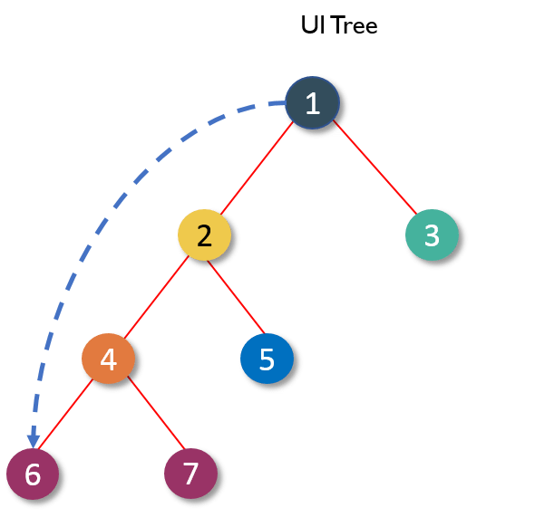
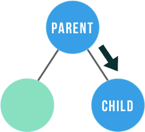
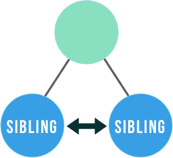

# Buổi 13
React Component communication

# Mở đầu
UI được tạo từ React là một tập hợp Component được tổ chức theo cây. Các component có các quan hệ như parent-child, child-parent, sibling



Như hình trên, 2-4 là parent-child, 5-2 là child-parent, 6-7 hoặc 4-3 là sibling

Vấn đề đặt ra ở đây là làm cách nào để giao tiếp với các component. Giao tiếp ở đây có thể hiểu là từ component A có thể thay đổi được component B và ngược lại

# Parent-to-child with props
Data trong React đi theo cơ chế "one-way data binding", có nghĩa là data sẽ đi theo một chiều, từ trên xuống dưới.



Để component cha có thể thay đổi giao diện giao diện con thì ta chỉ cần truyền props xuống dưới, component con nhận props đó để render ra giao diện. Khi component cha thay đổi props, lập tức component con thay đổi theo.

```
function Welcome(props) {
  return <h1>Hello, {props.name}</h1>;
}

class App extends React.Component {
  state = { name: 'Sara' }

  render() {
    return (
      <div>
        <button onClick={() => this.setState({ name: 'Evan' })}>
          Change name
        </button>
        <Welcome name={this.state.name} />
      </div>
    );
  }
  
}
```
Trong ví dụ trên, Component cha là App muốn khi nào click button thì thay đổi giao diện Component con Welcome => Change state của App => Props cho Welcome thay đổi => Welcome thay đổi UI

# Child-to-parent with function props


Bây h, trong trường hợp component con muốn thay đổi giao diện component cha thì làm thế nào?

Vì React là one-way data binding nên không thể có cách component con truyền ngược data lên trên. Do đó, muốn component cha thay đổi thì component cha phải tự mình thay đổi dữ liệu (state). 

Để làm được điều đó thì ta sử dụng kĩ thuật function props. 

=> Tức là component cha truyền xuống cho component con một function có thể thay đổi được được state. Component con khi có props là function đó có thể gọi => state cha thay đổi => component thay đổi UI

Với kĩ thuật function props, component con có thể truyền dữ liệu vào tham số của function để component cha có thể nhận được dữ liệu đó.

```
class App extends React.Component {
  state = { name: 'Matt' }

  onChangeName = (newName = "Default" ) => { 
    this.setState({ name: newName 
  })}

  render() {
    return (
      <div>
        <div>My name is {props.name}</div>
        <AppChild newName="Bill" onChangeName={this.onChangeName} />
        <AppChild newName="Paul" onChangeName={this.onChangeName} />
      </div>
    )
  }
}

function AppChild(props){
  return (
      <button 
        onClick={() => props.onChangeName(props.newName)}
      >
        Change name
      </button>
  )
}
```

# Sibling-to-sibling with lifting state up


Bây h, với 2 component A, B là anh em, component này muốn thay đổi UI component kia thì ta sử dụng 2 cơ chế đã học bên trên.

Ta đẩy dữ liệu ảnh hưởng với cả 2 component, nên component cha (gọi là X) của cả 2 (không nhất thiết là gần nhất). Khi đó, component A thay đổi state của component X qua cơ chế function props. X chịu trách nhiệm thay đổi A và B theo cơ chế props down.

```
class App extends React.Component {
  state = { seconds: 0 }

  changeSecond = (e) => { 
    this.setState({
      seconds: e.target.value
    })
  })}

  changeMin = (e) => { 
    this.setState({
      seconds: +e.target.value * 60
    })
  })}

  render() {
    const minute = Math.floor(props.seconds / 60)

    return (
      <div>
        <SecondInput seconds={seconds} changeTime={this.changeSecond} />
        <MinuteInput minute={minute} changeTime={this.changeMin}>
      </div>
    )
  }
}

function SecondInput(props){
  return (
      <div>
        <span>Đơn vị giây</span>
        <input value={props.seconds} onChange={props.changeTime} />
      </div>
  )
}

function MinuteInput(props){
  return (
      <div>
        <span>Đơn vị phút</span>
        <input value={props.minute} onChange={props.changeMin} />
      </div>
  )
}
```

Đôi khi, các component anh em quá xa nhau, ta khó khăn trong việc không biết lift up đến khi nào là đủ, cộng với việc có thể props down quá nhiều component (A xuống B, B xuống C, C xuống D, ...) thì ta sẽ nghĩ đến sử dụng các khái niệm như Context và Global State (của một số thư viện như redux) để giải quyết