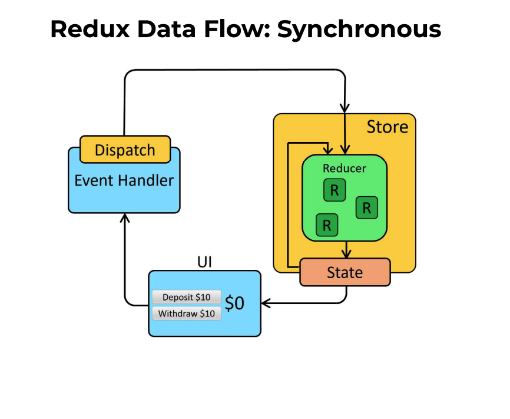
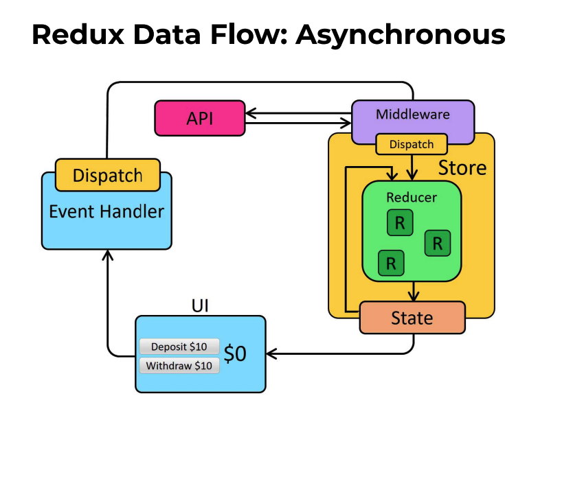

# Buổi 20
- Redux
- Làm quen và áp dụng redux toolkit

# Tại sao lại cần Redux
Qua những bài đã học, ta thấy để các component có thể dùng chung dữ liệu (props) thì ta phải đẩy state lên các component cao hơn (lift state up) và truyền props xuống dưới

Điều này dẫn tới một số vấn đề như:
- Không biết lift đến component nào là đủ (khi quá nhiều component ở nhiều cấp khác nhau)
- Props drilling (truyền props xuống quá nhiều cấp component)

Ví dụ như bài trước thông tin user được sử dụng ở rất nhiều component khác nhau và ta đã giải quyết qua context

Hiện h, context và hook cơ bản đã giải quyết được vấn đề trên. Tuy nhiên, từ trước đến giờ, một trong những thư viện nổi tiếng là redux cũng đã giải quyết rất tốt.

Cách của redux để giải quyết vấn đề trên là:
- Lift state đến cấp cao nhất là global gọi nó là một store
- Các component nào muốn sử dụng props thì mới lắng nghe sự thay đổi của store qua một cơ chế subcribe

Redux và pattern của redux giúp style code của project đi theo một mẫu nhất định, cũng giúp code dễ bảo trì hơn

# Làm quen với redux
Tư tưởng chính của Redux là
- Single source of truth: đó là toàn bộ state của app sẽ tập trung là một **store** duy nhất
- State is read-only: state không được chỉnh sửa trực tiếp từ component. Khi cần update state, component sẽ **dispatch** một **action** để store lắng nghe và chỉnh sửa
- Changes are made with pure functions: state sẽ được chỉnh sửa bởi các pure function (pure function là các hàm xử lý logic mà không làm thay đổi các tham số đầu vào). Pure function xử lý state trong redux được gọi là reducers

Redux Data Flow




Redux là một tư tưởng có thể áp dụng ở bất kì framework nào khác ngoài react. Còn khi áp dụng với react thì bắt đầu như sau

```
npm install @reduxjs/toolkit react-redux
```
Khởi tạo slice (bao gồm reducer và các action)
```
import { createSlice } from '@reduxjs/toolkit'

export const counterSlice = createSlice({
  name: 'counter',
  initialState: {
    value: 0
  },
  reducers: {
    increment: state => {
      // Redux Toolkit allows us to write "mutating" logic in reducers. It
      // doesn't actually mutate the state because it uses the Immer library,
      // which detects changes to a "draft state" and produces a brand new
      // immutable state based off those changes
      state.value += 1
    },
    decrement: state => {
      state.value -= 1
    },
    incrementByAmount: (state, action) => {
      state.value += action.payload
    }
  }
})

// Action creators are generated for each case reducer function
export const { increment, decrement, incrementByAmount } = counterSlice.actions

export default counterSlice.reducer
```
Config store và gắn store với App. Store chỉ có một và là tập hợp của các reducer
```
import { configureStore } from '@reduxjs/toolkit'
import counterReducer from '../features/counter/counterSlice'

export default configureStore({
  reducer: {
    counter: counterReducer
  }
})

import React from 'react'
import ReactDOM from 'react-dom'
import './index.css'
import App from './App'
import store from './app/store'
import { Provider } from 'react-redux'

ReactDOM.render(
  <Provider store={store}>
    <App />
  </Provider>,
  document.getElementById('root')
)
```

Lắng nghe sự thay đổi của state và dispatch action. Ta sẽ sử dụng 2 custom hook là useSelector và useDispatch

useSelector nhận đầu vào là một function tham số là state (chính là state tổng chứa các state cấp nhỏ hơn chính là các state có trong reducer, cuối cùng là state cụ thể mà mình cần lắng nghe)

useDispatch trả về kết quả một function dispatch, khi cần thay đổi dữ liệu dispatch sẽ dispatch một action. Ở đây increment() là một hàm trong slice trả về một action tương ứng.

```
import React from 'react'
import { useSelector, useDispatch } from 'react-redux'
import { decrement, increment } from './counterSlice'
import styles from './Counter.module.css'

export function Counter() {
  const count = useSelector(state => state.counter.value)
  const dispatch = useDispatch()

  return (
    <div>
      <div>
        <button
          aria-label="Increment value"
          onClick={() => dispatch(increment())}
        >
          Increment
        </button>
        <span>{count}</span>
        <button
          aria-label="Decrement value"
          onClick={() => dispatch(decrement())}
        >
          Decrement
        </button>
      </div>
    </div>
  )
}
```
Action có ở đây là một sync action, còn khi là một async action (ví dụ như fetchAPI), ta cần sử dụng createActionThunk
```
export const fetchPosts = createAsyncThunk('posts/fetchPosts', async () => {
  const response = await client.get('/fakeApi/posts')
  return response.data
})

const postsSlice = createSlice({
  name: 'posts',
  initialState,
  reducers: {
    // omit existing reducers here
  },
  extraReducers(builder) {
    [fetchPosts.pending] (state, action) => {
        state.status = 'loading'
    })
    [fetchPosts.fulfilled], (state, action) => {
        state.status = 'succeeded'
        // Add any fetched posts to the array
        state.posts = state.posts.concat(action.payload)
    })
    [fetchPosts.rejected]: (state, action) => {
        state.status = 'failed'
        state.error = action.error.message
    })
  }
})
```
Hàm createActionThunk sẽ tự động dispatch các action pending, fulfilled, rejected khi thực hiện async function fetchPosts. Từ đó ta có thể lắng nghe các action đó để thay đổi state tương ứng